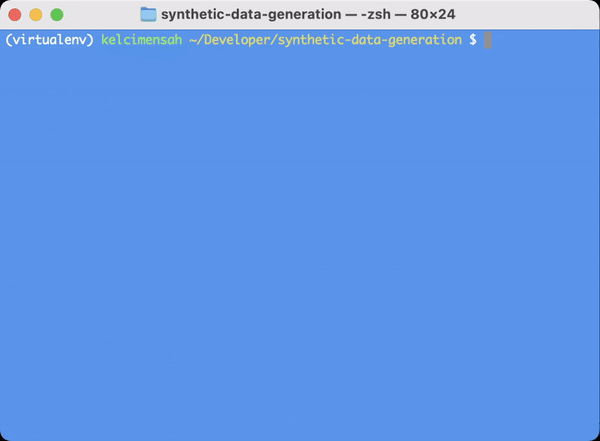

# Synthetic Data Generation 🤖

This project offers a flexible solution for generating customizable fake data, empowering other developers to enhance web applications, software, and machine learning projects with no-bloat tools for development.

### File Structure 📑

* `generators/`: Core modules for generating structured media data.
    * `Book.py`: Handles generation logic for book objects, including titles, authors, genres, and other relevant metadata.
    * `FavoritedBook.py`: Handles data generation specific to user-favorited books, including relationships between users and book objects.
    * `User.py`: Handles generation logic to create fake user profiles, such as usernames, passwords, email addresses, and other user-specific information.
* `converters/`: Provides utilities to convert generated data into different formats.
    * `to_json.py`: Converts data to JSON format.
    * `to_csv.py`: Converts data to CSV format.
* `sample_outputs/`: Stores examples of generated data in various formats.
* `README.md`: This file! 👋

### Getting Started 🚀

1. Clone the repository.
2. Create and activate a virtual environment.
```zsh
python3 -m venv virtualenv
source virtualenv/bin/activate
```
3. Install Python dependencies.
```zsh
pip install -r requirements.txt
```
4. From the root folder, run the `dialogue.py` file using this command and follow the terminal workflow.
```zsh
python3 dialogue.py
```
5. That's it! To exit the data generation program, enter `CTRL` + `C` at any time. Happy data generating!

### Sample Data Generation Workflow ✨
<!--  -->
( .gif preview coming soon )